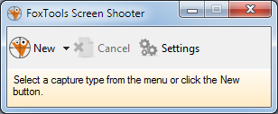
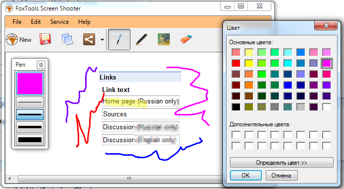
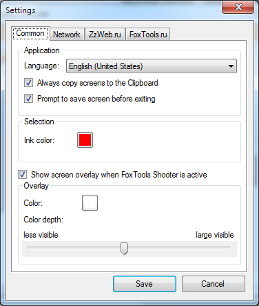

# FoxTools Screen Shooter

Small program for creating screenshots.

## Features

* Capturing the screen in one of three modes: free form, rectangle, full screen.
* Drawing tools: pen, marker, pixelization, eraser.
* Send images to the FoxTools.ru or ZzWeb.ru.
* Saving images in graphic formats: PNG, JPG (JPEG), and GIF.
* Multilingual interface.

## License

GNU GPL v3

(c) Aleksey Nemiro, 2013
